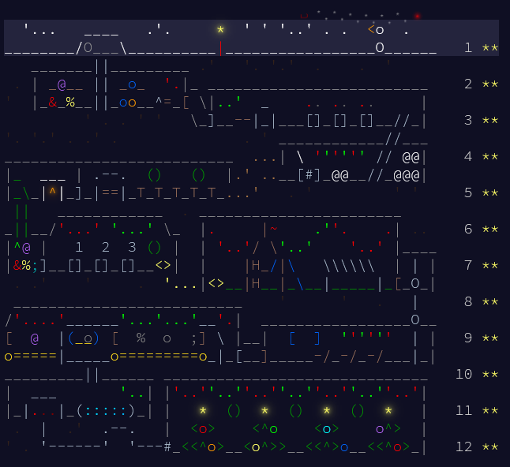

# [⛄ Advent Of Code 2025 ⛄](https://adventofcode.com/2025)

As for last year, I'm doing the advent of code using Rust.



This year, there was only 12 days available for the challenge!

## Usage

You can run my solutions by running the following commands:

```sh
cd day<day_number>
cargo run
```

If needed you can use the `--release` flag to run the optimized version of the code.

To run a specific part, use the following commands:

```sh
cargo run -- --part1  # Run part 1 only
cargo run -- --part2  # Run part 2 only
```

If no arguments are provided, both parts will be run by default.

In the output, you will see the answers and the time it took for each part to run.

Make sure that the test input provided in the problem is set in the `inputtest.txt` file in the `day<day_number>` folder, and the real input is set in the `input.txt` file.

## Benchmarks

By default, when running the code, a benchmark for the time will be run as well. However this approach is very simple and not very accurate. If you want to run a more accurate benchmark, you can use the following command:

```sh
cargo bench
```

This will run benchmarks using the `criterion` crate and will give you a more accurate time for each part.

## Tests

Unit tests are provided in the `lib.rs` file for each day. Make sure you set the correct result for each test before running them.
There are both test for the test input provided in the problem and for the real input.

To run the tests, use the following command:

```sh
cargo test --lib
```

## Fetching the input

If there is no `input.txt` file for the current day, the code will automatically fetch the input from the Advent of Code website. You will need to provide your session cookie in the `.env` file in the root of the project as `SESSION_TOKEN`. The cookie can be found in the browser after logging in to the website.

In the `main.rs` file you should also set the `year` variable to the correct year of the challenge. If needed you can also do this manually for the day, but in the current template it will get the day automatically according to the folder name (with the following format : `day<day_number>`).

If the `input.txt` file is already present, the code will not fetch the input again, so you can run the code offline. However, if you want to fetch the input again, you can use the following command:

```sh
cargo run -- --fetch
```

## Using the test input file

If you first want to test your solution with a given test input file, you can create manually a `inputtest.txt` file in the `day<day_number>` folder and set the test input there. Then you can run the code with the following command:

```sh
cargo run -- --test
```

This command will run the code with the test input file instead of the real input file.

## Cleaning all

I also provide a `clean_all.ps1` script that you can use to clean all the `target` folders in all the project that starts with `day`.

## Solutions

The solutions for each day can be found in the following table. The time are being calculated using the `criterion` crate for accurate benchmarks. Note that most of the challenges are done without any parallelism, except for some days where I judged it was necessary to get faster results.

The difficulty is a subjective value that I give to the challenge, based on the time it took me to solve it, the complexity of the problem and other factors that I consider important at the time I solved it. The possible ratings are the following : ⚪ (no difficulty), 🟢 (easy), 🟡 (medium), 🟠 (hard), 🔴 (very hard), ⚫ (extreme). Other criteria could be given along the difficulty : 🔵 (long), 🟣 (hand made / use of a trick), 🟤 (brute force), 📖 (learned something / new algorithm), ❓ (hard to understand), 🦀 (harder in rust).

| 🗓️Day🗓️ | ⛄Part 1 Solution⛄ | 🎁Part 2 Solution🎁 | ❄️Part 1 Time❄️ | 🎄Part 2 Time🎄 | 🏔️Difficulty🏔️ |
|:-------:|:------------------:|:------------------:|:--------------:|:--------------:| :------------: |
| 🗓️1🗓️ | ⛄[/day1/src/part1.rs](/day1/src/part1.rs)⛄ | 🎁[/day1/src/part2.rs](/day1/src/part2.rs)🎁 | ❄️32.184 µs❄️ | 🎄35.325 µs🎄 | 🏔️ 🟡 🏔️ |
| 🗓️2🗓️ | ⛄[/day2/src/part1.rs](/day2/src/part1.rs)⛄ | 🎁[/day2/src/part2.rs](/day2/src/part2.rs)🎁 | ❄️79.347 ms❄️ | 🎄97.443 ms🎄 | 🏔️ ⚪ 🏔️ |
| 🗓️3🗓️ | ⛄[/day3/src/part1.rs](/day3/src/part1.rs)⛄ | 🎁[/day3/src/part2.rs](/day3/src/part2.rs)🎁 | ❄️86.378 µs❄️ | 🎄193.44 µs🎄 | 🏔️ 🟢 🏔️ |
| 🗓️4🗓️ | ⛄[/day4/src/part1.rs](/day4/src/part1.rs)⛄ | 🎁[/day4/src/part2.rs](/day4/src/part2.rs)🎁 | ❄️114.83 µs❄️ | 🎄2.0887 ms🎄 | 🏔️ ⚪ 🏔️ |
| 🗓️5🗓️ | ⛄[/day5/src/part1.rs](/day5/src/part1.rs)⛄ | 🎁[/day5/src/part2.rs](/day5/src/part2.rs)🎁 | ❄️104.09 µs❄️ | 🎄26.838 µs🎄 | 🏔️ 🟢 🏔️ |
| 🗓️6🗓️ | ⛄[/day6/src/part1.rs](/day6/src/part1.rs)⛄ | 🎁[/day6/src/part2.rs](/day6/src/part2.rs)🎁 | ❄️73.297 µs❄️ | 🎄2.3391 ms🎄 | 🏔️ 🟢 🏔️ |
| 🗓️7🗓️ | ⛄[/day7/src/part1.rs](/day7/src/part1.rs)⛄ | 🎁[/day7/src/part2.rs](/day7/src/part2.rs)🎁 | ❄️69.447 µs❄️ | 🎄64.312 µs🎄 | 🏔️ 🟢 🏔️ |
| 🗓️8🗓️ | ⛄[/day8/src/part1.rs](/day8/src/part1.rs)⛄ | 🎁[/day8/src/part2.rs](/day8/src/part2.rs)🎁 | ❄️31.665 ms❄️ | 🎄103.53 ms🎄 | 🏔️ 🟡📖 🏔️ |
| 🗓️9🗓️ | ⛄[/day9/src/part1.rs](/day9/src/part1.rs)⛄ | 🎁[/day9/src/part2.rs](/day9/src/part2.rs)🎁 | ❄️159.56 µs❄️ | 🎄19.850 ms🎄 | 🏔️ 🔴📖 🏔️ |
| 🗓️10🗓️ | ⛄[/day10/src/part1.rs](/day10/src/part1.rs)⛄ | 🎁[/day10/src/part2.rs](/day10/src/part2.rs)🎁 | ❄️0.011174 s❄️ | 🎄0.829446 s🎄 | 🏔️ 🔴 🏔️ |
| 🗓️11🗓️ | ⛄[/day11/src/part1.rs](/day11/src/part1.rs)⛄ | 🎁[/day11/src/part2.rs](/day11/src/part2.rs)🎁 | ❄️435.59 µs❄️ | 🎄765.71 µs🎄 | 🏔️ 🟡 🏔️ |
| 🗓️12🗓️ | ⛄[/day12/src/part1.rs](/day12/src/part1.rs)⛄ | 🎁[/day12/src/part2.rs](/day12/src/part2.rs)🎁 | ❄️316.85 µs❄️ | 🎄⭐🎄 | 🏔️ ⚫->⚪ 🏔️ |
<!-- | 🗓️13🗓️ | ⛄[/day13/src/part1.rs](/day13/src/part1.rs)⛄ | 🎁[/day13/src/part2.rs](/day13/src/part2.rs)🎁 | ❄️___❄️ | 🎄___🎄 | 🏔️ _ 🏔️ | -->
<!-- | 🗓️14🗓️ | ⛄[/day14/src/part1.rs](/day14/src/part1.rs)⛄ | 🎁[/day14/src/part2.rs](/day14/src/part2.rs)🎁 | ❄️___❄️ | 🎄___🎄 | 🏔️ _ 🏔️ | -->
<!-- | 🗓️15🗓️ | ⛄[/day15/src/part1.rs](/day15/src/part1.rs)⛄ | 🎁[/day15/src/part2.rs](/day15/src/part2.rs)🎁 | ❄️___❄️ | 🎄___🎄 | 🏔️ _ 🏔️ | -->
<!-- | 🗓️16🗓️ | ⛄[/day16/src/part1.rs](/day16/src/part1.rs)⛄ | 🎁[/day16/src/part2.rs](/day16/src/part2.rs)🎁 | ❄️___❄️ | 🎄___🎄 | 🏔️ _ 🏔️ | -->
<!-- | 🗓️17🗓️ | ⛄[/day17/src/part1.rs](/day17/src/part1.rs)⛄ | 🎁[/day17/src/part2.rs](/day17/src/part2.rs)🎁 | ❄️___❄️ | 🎄___🎄 | 🏔️ _ 🏔️ | -->
<!-- | 🗓️18🗓️ | ⛄[/day18/src/part1.rs](/day18/src/part1.rs)⛄ | 🎁[/day18/src/part2.rs](/day18/src/part2.rs)🎁 | ❄️___❄️ | 🎄___🎄 | 🏔️ _ 🏔️ | -->
<!-- | 🗓️19🗓️ | ⛄[/day19/src/part1.rs](/day19/src/part1.rs)⛄ | 🎁[/day19/src/part2.rs](/day19/src/part2.rs)🎁 | ❄️___❄️ | 🎄___🎄 | 🏔️ _ 🏔️ | -->
<!-- | 🗓️20🗓️ | ⛄[/day20/src/part1.rs](/day20/src/part1.rs)⛄ | 🎁[/day20/src/part2.rs](/day20/src/part2.rs)🎁 | ❄️___❄️ | 🎄___🎄 | 🏔️ _ 🏔️ | -->
<!-- | 🗓️21🗓️ | ⛄[/day21/src/part1.rs](/day21/src/part1.rs)⛄ | 🎁[/day21/src/part2.rs](/day21/src/part2.rs)🎁 | ❄️___❄️ | 🎄___🎄 | 🏔️ _ 🏔️ | -->
<!-- | 🗓️22🗓️ | ⛄[/day22/src/part1.rs](/day22/src/part1.rs)⛄ | 🎁[/day22/src/part2.rs](/day22/src/part2.rs)🎁 | ❄️___❄️ | 🎄___🎄 | 🏔️ _ 🏔️ | -->
<!-- | 🗓️23🗓️ | ⛄[/day23/src/part1.rs](/day23/src/part1.rs)⛄ | 🎁[/day23/src/part2.rs](/day23/src/part2.rs)🎁 | ❄️___❄️ | 🎄___🎄 | 🏔️ _ 🏔️ | -->
<!-- | 🗓️24🗓️ | ⛄[/day24/src/part1.rs](/day24/src/part1.rs)⛄ | 🎁[/day24/src/part2.rs](/day24/src/part2.rs)🎁 | ❄️___❄️ | 🎄___🎄 | 🏔️ _ 🏔️ | -->
<!-- | 🗓️25🗓️ | ⛄[/day25/src/part1.rs](/day25/src/part1.rs)⛄ | 🎁[/day25/src/part2.rs](/day25/src/part2.rs)🎁 | ❄️___❄️ | 🎄50⭐🎄 | 🏔️ _ 🏔️ | -->

## Template

Do you want to use my rust template for your own solutions? 

Then just get the `template` folder from this repository and use the following command to create a new day:

```sh
cargo generate --path ./template
```

Then it will ask you for the project name, just enter the name you want to give for the day and it will create a new folder with the template code for you.

## Author

⛄ [ALXS](https://github.com/ALXS-GitHub)